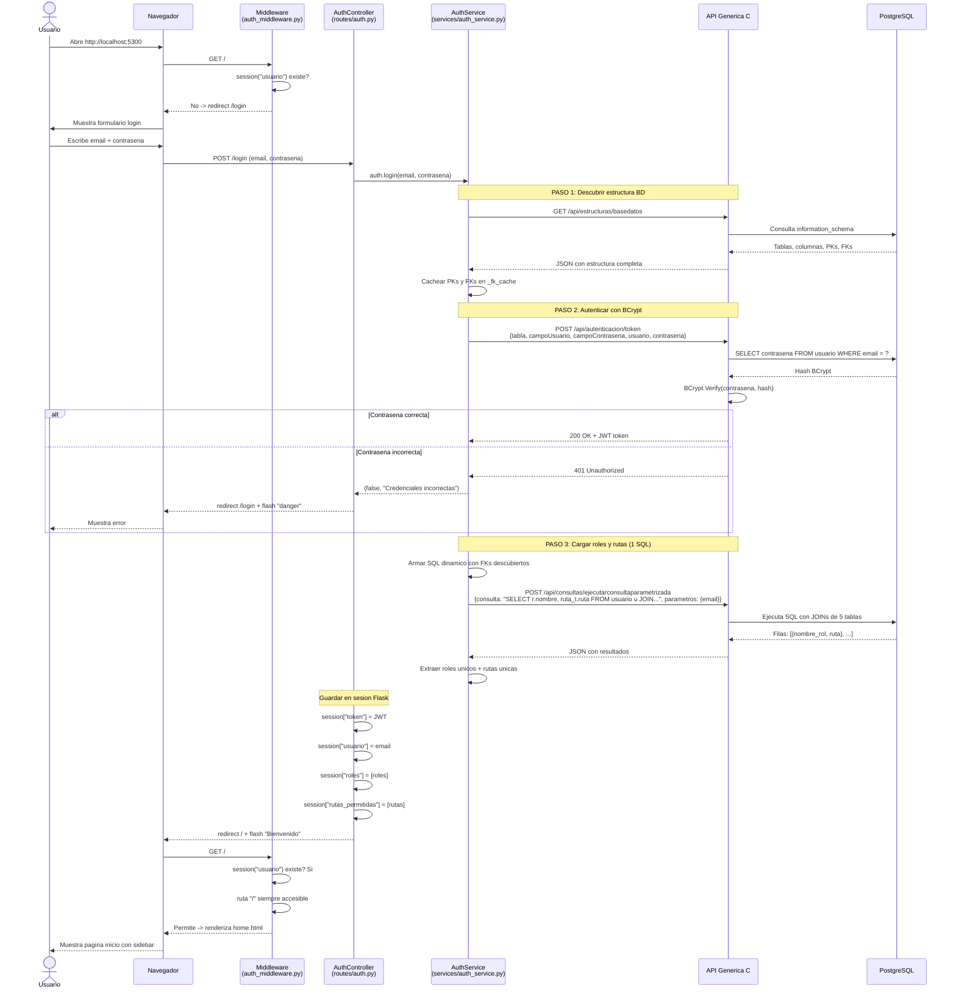
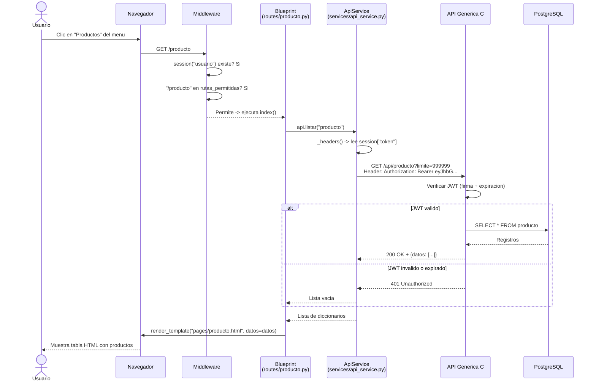
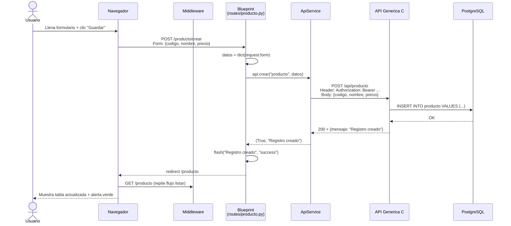
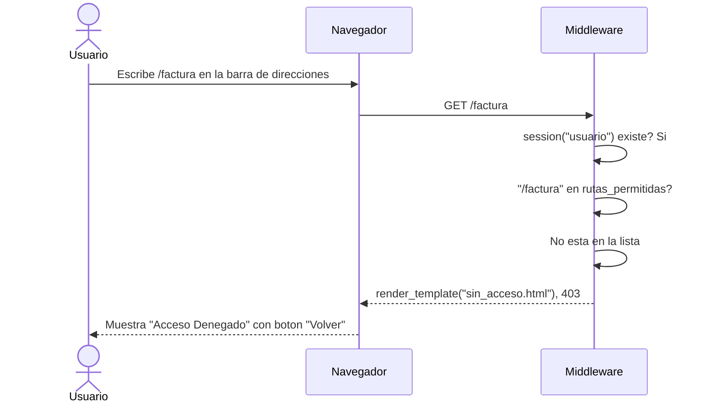
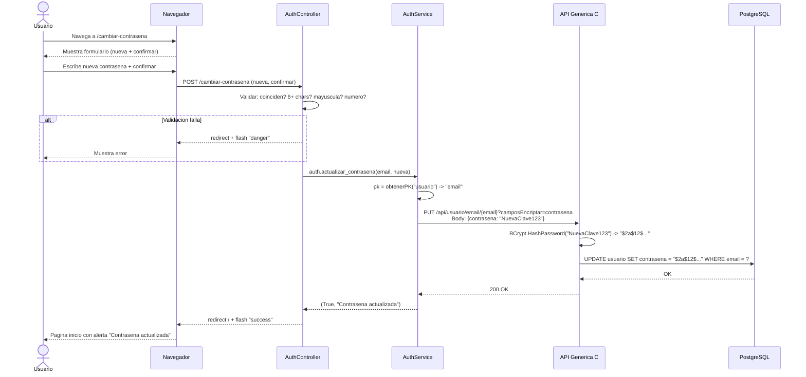
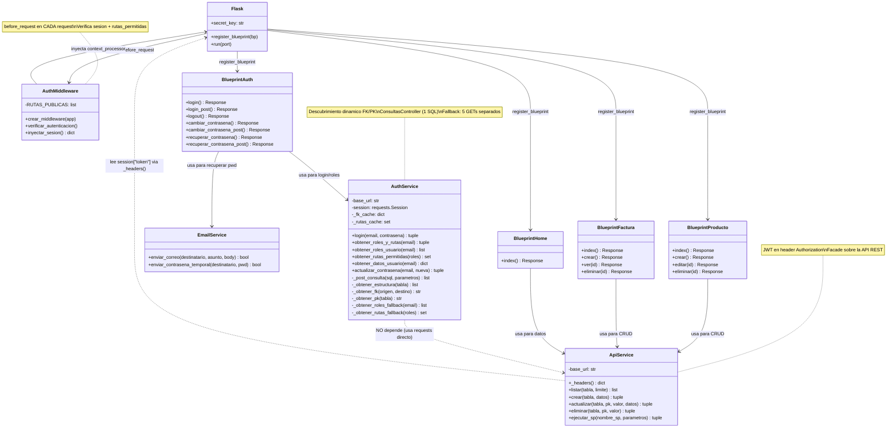

# Etapa 4: Plan de Implementacion

> Segun [Spec-Kit](https://github.com/github/spec-kit): el plan traduce los requisitos de la
> especificacion en decisiones tecnicas concretas. "Cada eleccion de tecnologia tiene una
> rationale documentada." El plan se genera con `/speckit.plan` y el humano lo valida.
>
> Referencia: [plan-template.md](https://github.com/github/spec-kit/blob/main/templates/plan-template.md)

---

## 1. Resumen tecnico

Frontend web en Flask que consume la API generica C# via HTTP.
Arquitectura MVC adaptada: routes (controladores) + services (logica) + templates (vistas).
Autenticacion con BCrypt + JWT + sesion Flask.
Control de acceso por roles y rutas con middleware `before_request`.

## 2. Estructura de archivos del proyecto

```
FrontFlaskTutorial/
├── app.py                           <- Punto de entrada: crea Flask, registra todo
├── config.py                        <- API_BASE_URL, SECRET_KEY, SMTP
├── requirements.txt                 <- flask, requests
├── .gitignore                       <- venv/, __pycache__/, *.pyc
│
├── services/
│   ├── __init__.py
│   ├── api_service.py               <- CRUD generico: listar, crear, actualizar, eliminar
│   ├── auth_service.py              <- Login, roles, rutas, ConsultasController, fallback
│   └── email_service.py             <- SMTP para contrasena temporal
│
├── routes/
│   ├── __init__.py
│   ├── home.py                      <- /
│   ├── auth.py                      <- /login, /logout, /cambiar-contrasena, /recuperar
│   ├── producto.py                  <- /producto (CRUD)
│   ├── persona.py                   <- /persona (CRUD)
│   ├── usuario.py                   <- /usuario (CRUD)
│   ├── cliente.py                   <- /cliente (CRUD con FK persona, empresa)
│   ├── empresa.py                   <- /empresa (CRUD)
│   ├── vendedor.py                  <- /vendedor (CRUD)
│   ├── rol.py                       <- /rol (CRUD)
│   ├── ruta.py                      <- /ruta (CRUD)
│   └── factura.py                   <- /factura (maestro-detalle)
│
├── middleware/
│   └── auth_middleware.py           <- before_request + context_processor
│
├── templates/
│   ├── layout/
│   │   └── base.html                <- Layout: sidebar + top-row + content + Bootstrap
│   ├── components/
│   │   └── nav_menu.html            <- Menu lateral colapsable
│   └── pages/
│       ├── home.html                <- Pagina inicio
│       ├── login.html               <- Formulario login
│       ├── cambiar_contrasena.html   <- Cambiar contrasena
│       ├── recuperar_contrasena.html <- Recuperar contrasena
│       ├── sin_acceso.html           <- Error 403
│       ├── producto.html             <- CRUD producto
│       ├── persona.html              <- CRUD persona
│       ├── usuario.html              <- CRUD usuario
│       ├── cliente.html              <- CRUD con selects FK
│       ├── empresa.html              <- CRUD empresa
│       ├── vendedor.html             <- CRUD vendedor
│       ├── rol.html                  <- CRUD rol
│       ├── ruta.html                 <- CRUD ruta
│       └── factura.html              <- Maestro-detalle
│
├── static/css/
│   └── app.css                      <- Variables CSS, estilos custom
│
├── scripts_bds/                     <- SQL para crear tablas
│
└── sdd/                             <- Documentacion SDD (estos archivos)
```

## 3. Orden de implementacion (por pasos)

> Cada paso corresponde a un Paso{N}.md del tutorial y a una o mas ramas feature/.

| Orden | Paso | Que se implementa | Dependencias | Estudiante |
|-------|------|--------------------|-------------|------------|
| 1 | Paso 0 | Plan de desarrollo, reglas | Ninguna | Todos |
| 2 | Paso 3 | Proyecto base: app.py, config.py, git | Paso 0 | Est. 1 |
| 3 | Paso 4 | ApiService (CRUD generico HTTP) | Paso 3 | Est. 1 |
| 4 | Paso 5 | Layout base, nav_menu, home | Paso 4 | Est. 1 |
| 5 | Paso 6 | CRUD producto | Paso 5 | Est. 1 |
| 6 | Paso 7 | CRUD persona + usuario | Paso 5 | Est. 2 + 3 |
| 7 | Paso 8 | CRUD empresa, cliente, rol | Paso 7 | Est. 2 |
| 8 | Paso 9 | CRUD ruta, vendedor, nav_menu | Paso 7 | Est. 3 |
| 9 | Paso 10 | Factura maestro-detalle | Paso 8+9 | Est. 2 |
| 10 | Paso 12 | Login + JWT + middleware + roles | Paso 9 | Est. 1 |

### Diagrama de dependencias

```
Paso 0 (plan)
  |
  v
Paso 3 (proyecto base)
  |
  v
Paso 4 (ApiService)
  |
  v
Paso 5 (layout + nav + home)
  |
  +-------+-------+
  v       v       v
Paso 6  Paso 7  (paralelo: producto, persona+usuario)
  |       |
  v       +-------+
  |       v       v
  |     Paso 8  Paso 9  (paralelo: empresa+cliente, ruta+vendedor)
  |       |       |
  |       v       v
  |     Paso 10   |   (factura, depende de 8+9)
  |               |
  +-------+-------+
          v
        Paso 12 (login + seguridad)
```

## 4. Modelo de datos

### Tablas CRUD (negocio)

| Tabla | PK | Campos clave | FKs |
|-------|-----|-------------|-----|
| producto | codigo | nombre, precio, existencia | - |
| persona | codigo | nombre, telefono, direccion | - |
| empresa | codigo | nombre, nit, direccion | - |
| cliente | id | credito | fkcodpersona->persona, fkcodempresa->empresa |
| vendedor | codigo | nombre, comision | - |
| usuario | email | contrasena (BCrypt), nombre | - |
| factura | numfactura | fecha, total | fkcodvendedor->vendedor, fkcodcliente->cliente |
| productosporfactura | id | cantidad, precio | fknumfact->factura, fkcodprod->producto |

### Tablas de seguridad (auth)

| Tabla | PK | Campos | FKs |
|-------|-----|--------|-----|
| rol | id | nombre | - |
| rol_usuario | id | - | fkemail->usuario, fkidrol->rol |
| ruta | id | ruta, descripcion | - |
| rutarol | id | - | fkidrol->rol, fkidruta->ruta |

## 5. Decisiones tecnicas

| Decision | Alternativa | Razon |
|----------|-------------|-------|
| ConsultasController (1 SQL) | 5 GETs separados | Eficiencia: BD filtra, no Python |
| Cookie firmada (Flask session) | JWT stateless | Flask lo trae integrado |
| `requests` sincrono | `httpx` async | Simplicidad para tutorial |
| Bootstrap CDN | npm install | Sin build tools |
| Middleware before_request | Decorador @login_required | Protege TODO automaticamente |
| context_processor | Pasar vars manual | Inyecta en todas las templates |

## 6. Endpoints de la API utilizados

### CRUD generico (cada tabla)

```
GET    /api/{tabla}?limite=N           <- Listar
POST   /api/{tabla}                    <- Crear
PUT    /api/{tabla}/{pk}/{valor}       <- Actualizar
DELETE /api/{tabla}/{pk}/{valor}       <- Eliminar
```

### Autenticacion y seguridad

```
POST   /api/autenticacion/token        <- Login BCrypt + JWT
GET    /api/estructuras/basedatos      <- Descubrir PKs/FKs
POST   /api/consultas/ejecutar...      <- SQL JOINs roles/rutas
PUT    /api/usuario/{pk}/{val}?camposEncriptar=contrasena  <- Cambiar clave
```

---

## 7. Diagramas de secuencia

> Los diagramas de secuencia muestran la interaccion entre componentes en el tiempo.
> Formato: [Mermaid](https://mermaid.js.org/) — se renderiza automaticamente en GitHub.

### 7.1 Secuencia: Login completo



### 7.2 Secuencia: CRUD Listar con JWT



### 7.3 Secuencia: CRUD Crear



### 7.4 Secuencia: Acceso denegado



### 7.5 Secuencia: Cambiar contrasena



---

## 8. Diagrama de clases

> Muestra las clases Python del proyecto, sus atributos, metodos y relaciones.
> Formato: [Mermaid](https://mermaid.js.org/) — se renderiza en GitHub.

### 8.1 Diagrama de clases completo



### 8.2 Relaciones entre clases

| Relacion | Tipo | Descripcion |
|----------|------|-------------|
| Flask -> AuthMiddleware | Composicion | Flask registra el middleware al iniciar |
| Flask -> Blueprints | Composicion | Flask registra todos los blueprints |
| Blueprints -> ApiService | Dependencia | Los blueprints CRUD usan ApiService para HTTP |
| BlueprintAuth -> AuthService | Dependencia | Auth usa AuthService para login/roles |
| BlueprintAuth -> EmailService | Dependencia | Auth usa EmailService para recuperar pwd |
| ApiService ..> Flask session | Uso | Lee token JWT de la sesion para _headers() |
| AuthService --|> ApiService | Independiente | AuthService NO depende de ApiService (usa requests directo) |

### 8.3 Por que AuthService es independiente de ApiService?

```
AuthService usa requests.Session() directo, NO ApiService.

Razon: ApiService puede tener firmas diferentes segun el proyecto
(listar vs listarAsync, parametros distintos, etc).
AuthService con requests directo funciona en CUALQUIER proyecto Flask.

AuthService                    ApiService
  |                              |
  +-- requests.Session()         +-- requests.get/post/put/delete
  |   (HTTP directo)             |   (con _headers() JWT)
  v                              v
  API Generica C#                API Generica C#
```

---

## Referencias Spec-Kit

- Formato plan: [plan-template.md](https://github.com/github/spec-kit/blob/main/templates/plan-template.md)
- Principio de simplicidad: [spec-driven.md, Articulo VII](https://github.com/github/spec-kit/blob/main/spec-driven.md)
- Flujo SDD: [README de Spec-Kit](https://github.com/github/spec-kit)
- Mermaid (diagramas): [mermaid.js.org](https://mermaid.js.org/)
